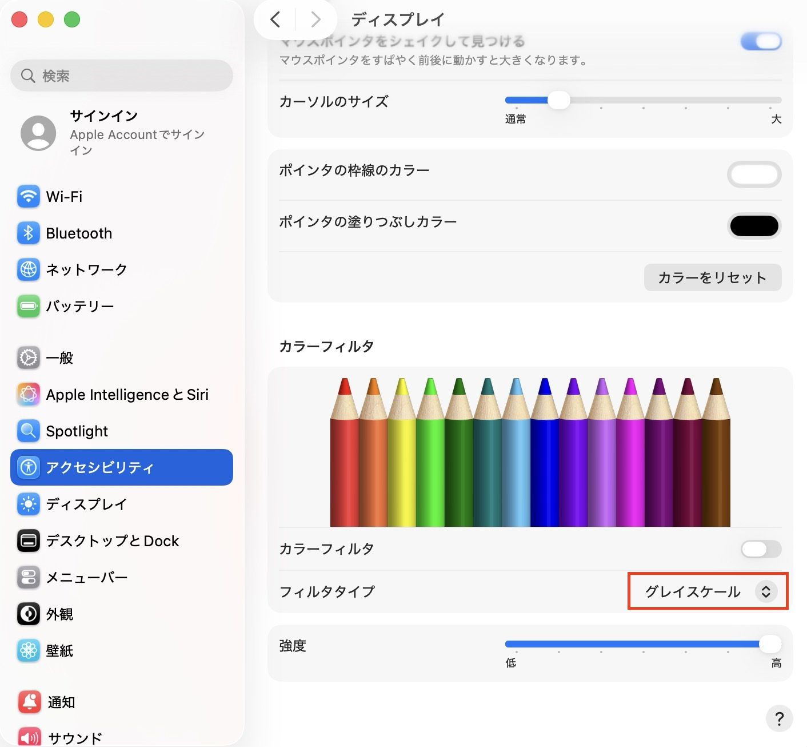
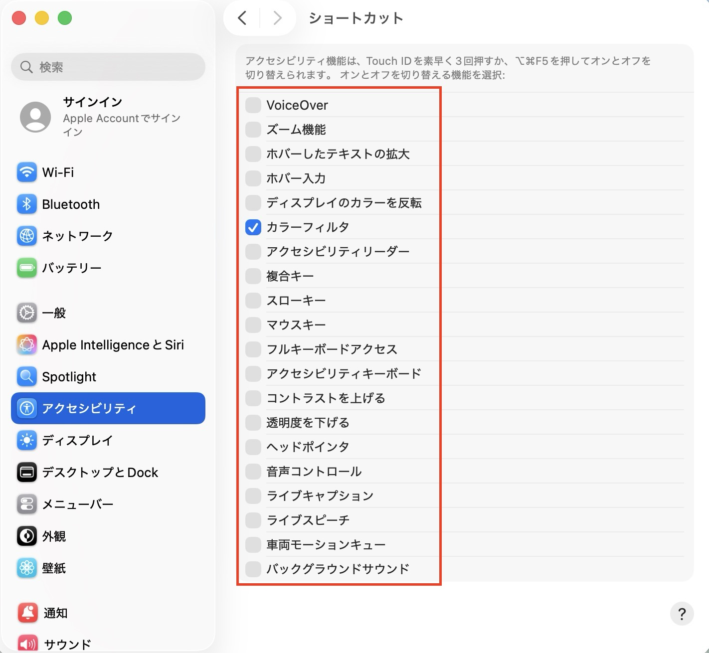
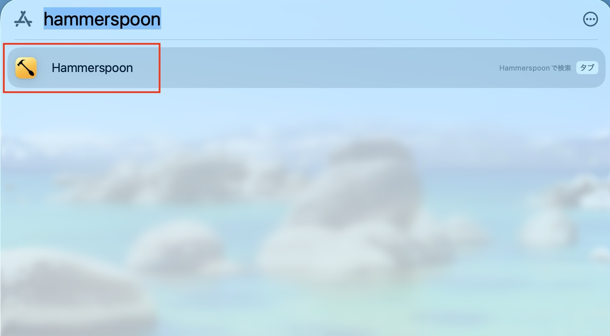
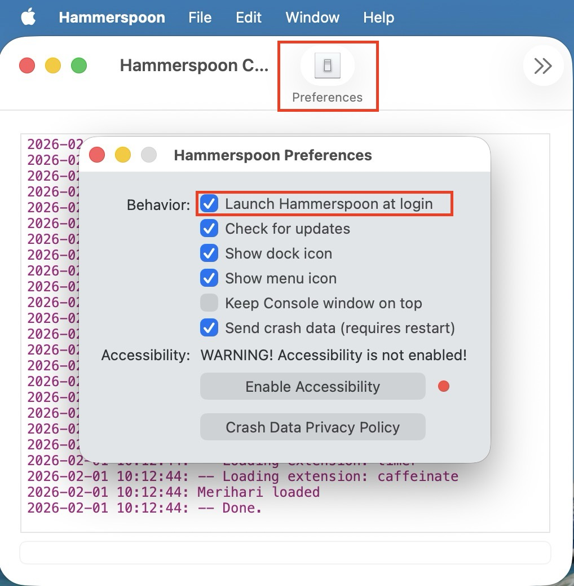
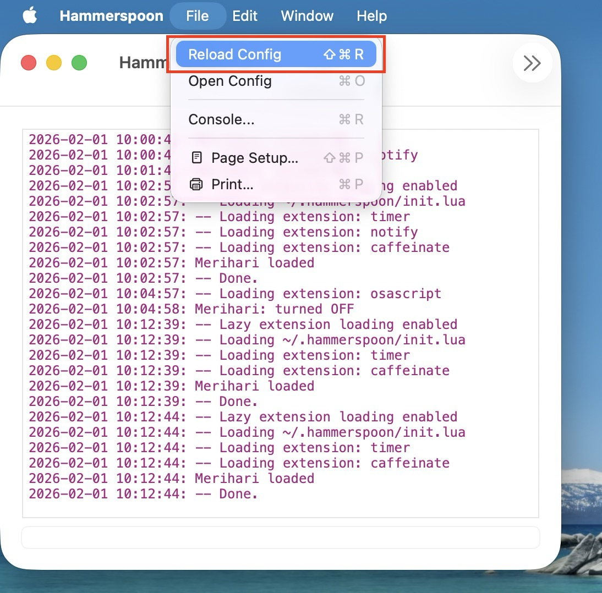
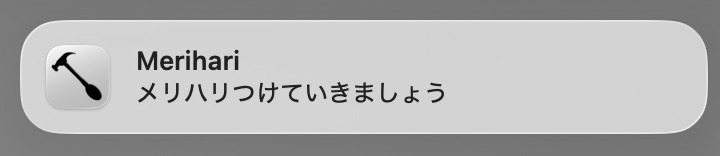
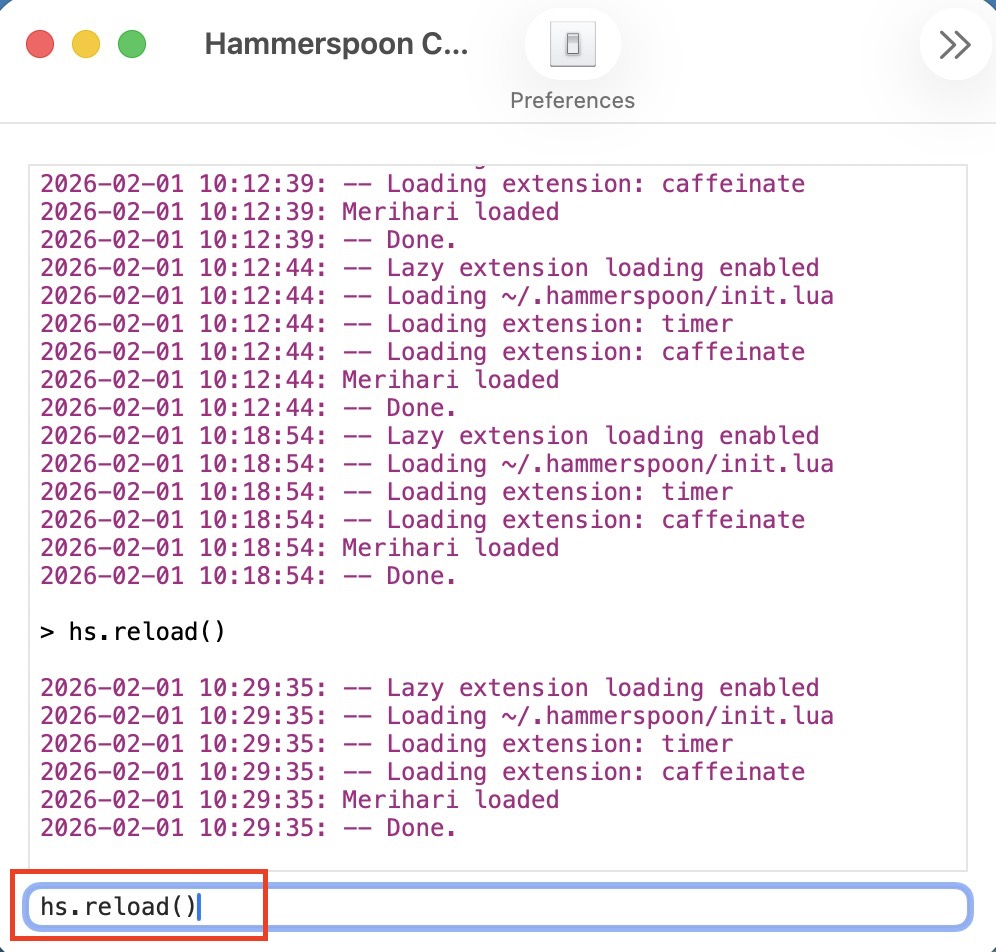

`Merihari` (メリハリ) is a macOS utility that helps you maintain healthy work-life rhythm
by automatically switching your screen to grayscale during configured time windows (e.g. 21:00–06:00).

The name "Merihari" means the balance between tension and relaxation in Japanese,
representing the healthy rhythm between focused work and proper rest.

It uses macOS built-in accessibility features and Hammerspoon.
Simple, lightweight, and reliable.

# Merihari (macOS)
指定した時間帯は画面をグレースケールにします（例: 21:00-翌6:00）。
macOS標準のアクセシビリティ設定（grayscale）を Hammerspoon で自動切替します。
メリハリのある生活リズムで、長期的なパフォーマンスを向上させましょう。

## Design
- Hammerspoon を使用して 60 秒ごとに時刻をチェックします
- 以下の場合にグレースケールを適用します
  - 指定の時刻範囲内の時
  - 指定の時刻範囲内に Mac へのログイン、ロック解除を行なった時
- 以下の場合にグレースケールを解除します
  - 指定の時刻範囲外の時
  - 指定の時刻範囲外に Mac へのログイン、ロック解除を行なった時
- 手動でフィルタを切り替えても、60 秒以内に自動で正しい状態に戻ります
- 指定の時刻範囲内は、60 秒ごとに通知を表示します
- 設定した時刻情報は以下に保存されます
  `~/.config/merihari/config`

## Requirements
- macOS
- Hammerspoon (https://www.hammerspoon.org/)

## Security

Merihari は以下のセキュリティ特性を持っています：

- **アクセシビリティ権限が必要**: グレースケールフィルタを切り替えるため、Hammerspoon にアクセシビリティ権限を付与する必要があります
- **最小限の権限使用**: キーボードショートカット（Cmd+Option+F5）の送信のみを行います
- **ネットワークアクセスなし**: 外部への通信は一切行いません
- **データ収集なし**: いかなる情報も収集・送信しません
- **外部依存なし**: macOS と Hammerspoon のみで動作します
- **ローカル設定**: すべての設定は `~/.config/merihari/` にローカル保存されます
- **オープンソース**: コードは完全に公開されており、動作を確認できます

**注意**: Hammerspoon は強力なアクセシビリティ権限を持ちます。他の Hammerspoon スクリプトを使用する場合は、それらのコードも確認することを推奨します。

## Install
1. システム設定 → アクセシビリティ → ディスプレイ → カラーフィルタ → フィルタタイプが「グレイスケール」になっていることを確認します
   
   

2. システム設定 → アクセシビリティ → ショートカット で カラーフィルタ以外のチェックを全て外します
   
   

3. ターミナルを開いて Hammerspoon をインストールします
   ```bash
   brew install --cask hammerspoon
   ```
   または https://www.hammerspoon.org/ からダウンロード
4. このリポジトリをクローンして setup を実行します
   ```bash
   git clone https://github.com/tadokoro88/merihari.git
   cd merihari
   ./setup.sh
   ```
5. Applications フォルダから Hammerspoon を起動します
   
   

6. アクセシビリティの権限を許可します（プロンプトが表示されます）
7. 通知の権限を許可します（システム設定 → 通知 → Hammerspoon で「通知を許可」をオンにする）
8. Hammerspoon の Preferences で「Launch Hammerspoon at login」にチェックを入れます
   
   

9. メニューバーの Hammerspoon アイコン → Reload Config をクリックします
   
   

10. 対象時間内になると、グレースケールに切り替わり、毎分通知が来るようになります
    
    

対象時間外では、グレーのフィルターは外れ、通知も止まります。

## Verify
- 設定ファイル:
```bash
cat ~/.config/merihari/config
```
- Hammerspoon の設定:
```bash
cat ~/.hammerspoon/merihari.lua
```
- Hammerspoon Console でログを確認（メニューバーアイコン → Console）

## Change Time Window
時刻設定を変更する場合:
```bash
cd merihari
./setup.sh
```
新しい時刻を入力すると、60 秒以内に自動で反映されます（手動リロード不要）

## Uninstall
```bash
cd merihari
./delete.sh
```
確認プロンプトで `y` を入力すると削除されます。
その後、Hammerspoon メニューバーアイコン → Reload Config をクリックします。

## Troubleshooting
### 権限がなく実行されない
Hammerspoon にアクセシビリティの操作を許可してください。
- システム設定 > プライバシーとセキュリティ > アクセシビリティ で Hammerspoon をオンにする
- システム設定 > プライバシーとセキュリティ > オートメーション で Hammerspoon が System Events に対してオンになっていることも確認

それでもうまくいかない場合は、設定をオンオフを切り替えるとうまくいくことがあります。
それでもダメなら Hammerspoon や PC の再起動でうまくいくこともあります。

### フィルタが反映されない
- Hammerspoon が起動しているか確認してください（メニューバーにアイコンがあるはずです）
- Hammerspoon Console でエラーがないか確認してください
- ロック中 / スリープ中は、意図的にフィルタ切替を実行しません（この間は ON/OFF ログも出ません）
- ロック解除 / 復帰時に再チェックし、さらに 60 秒ごとの定期チェックでも状態を補正します
- `failed to turn ON/OFF` が継続して出る場合は、アクセシビリティ権限とショートカット設定を見直してください
- 手動で反映:
```bash
# Hammerspoon Console で実行
hs.reload()
```
   
